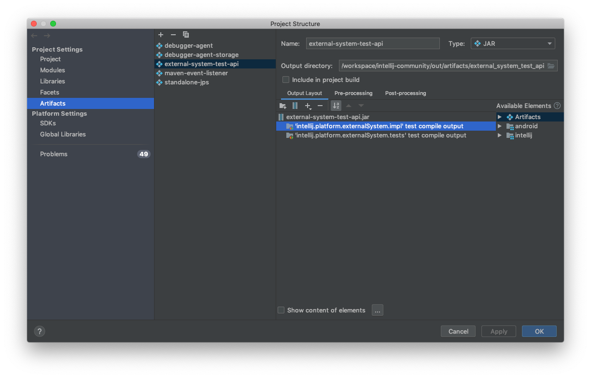

For contributing to the project, continue reading below.

### How the plugin works

The plugin uses `pants export <list of imported targets>` command to get the information about all targets to be imported
for the project in JSON format. It contains the information about all dependencies of a target
as well as the same information for each dependency. Then the plugin creates an IntelliJ module for each target, configures
dependencies(modules and libraries) and source roots.

Let's check an output of `./pants export examples/src/java/org/pantsbuild/example/hello/main:main-bin` command:

```json
{
    "libraries": {},
    "targets": {
        "examples/src/java/org/pantsbuild/example/hello/greet:greet": {
            "is_synthetic": false,
            "target_type": "SOURCE",
            "libraries": [],
            "pants_target_type": "java_library",
            "targets": [],
            "roots": [
                {
                    "source_root": "/Users/fkorotkov/workspace/pants/examples/src/java/org/pantsbuild/example/hello/greet",
                    "package_prefix": "org.pantsbuild.example.hello.greet"
                }
            ]
        },
        "examples/src/java/org/pantsbuild/example/hello/main:main-bin": {
            "is_synthetic": false,
            "target_type": "SOURCE",
            "libraries": [],
            "pants_target_type": "jvm_binary",
            "targets": [
                "examples/src/java/org/pantsbuild/example/hello/greet:greet",
                "examples/src/resources/org/pantsbuild/example/hello:hello"
            ],
            "roots": [
                {
                    "source_root": "/Users/fkorotkov/workspace/pants/examples/src/java/org/pantsbuild/example/hello/main",
                    "package_prefix": "org.pantsbuild.example.hello.main"
                }
            ]
        },
        "examples/src/resources/org/pantsbuild/example/hello:hello": {
            "is_synthetic": false,
            "target_type": "RESOURCE",
            "libraries": [],
            "pants_target_type": "resources",
            "targets": [],
            "roots": [
                {
                    "source_root": "/Users/fkorotkov/workspace/pants/examples/src/resources/org/pantsbuild/example/hello",
                    "package_prefix": "org.pantsbuild.example.hello"
                }
            ]
        }
    }
}
```

The plugin will create three modules. One for the imported target, examples/src/java/com/pants/examples/hello/main:main-bin
and two for the targets it depends on. It also will configure source roots for the modules and will use `target_type`
and `is_synthetic` fields to figure out types of source roots(there are several types of source roots: sources,
test sources, resources, test resources, generated sources, etc).

## Contributing Guidelines:

* Checkout the code

        git clone https://github.com/pantsbuild/intellij-pants-plugin

* Create a new branch off master to make your changes

        git checkout -b $FEATURE_BRANCH

* Push your branch

* Create a new pull request (PR) from your branch on Github, and make sure it passes [Travis CI](https://travis-ci.org/pantsbuild/intellij-pants-plugin/pull_requests)

* Label your PR **reviewable**, and add reviewers to 'Assignee' (If you are unsure who to add, take a look who touched the code last)

* Iterate over the review by making changes then push your branch

* Commit your change to master (Committer status required. If you are not one, please ask one to do so.)
  * Select **Squash and merge** on the PR
  * Fill out the description accordingly
  * Confirm

* Once Travis CI build succeeds for the commit, it will automatically deploy the plugin to `BleedingEdge` channel in [the plugin repo](https://plugins.jetbrains.com/plugin/7412)

### IntelliJ project setup:

* Download and open IntelliJ IDEA 2016 Community Edition
* Install Python, Scala Plugins
* Open the project via File -> Open, then select the plugin source folder. Do not import the plugin source as pants project because the plugin does not work on itself.
* Use IntelliJ IDEA 2016 Community Edition as IDEA IC SDK. Project Structure(Cmd + ;) -> SDK -> '+' button -> IntelliJ Platform Plugin SDK
* Set Scala 2.11.6 as your Scala SDK (Gold reference should be [the version used to build Scala plugin](https://github.com/JetBrains/intellij-scala/blob/idea163.x/.idea/artifacts/ScalaPlugins.xml#L41-L42))
* Make sure that your project is set to configure bytecode compatible with 1.8.  Preferences -> Compiler -> Java Compiler -> Project bytecode version
* Make sure your project language level is 8. Project Structure(Cmd + ; ) -> Project -> Project language level.
* Make sure you have a project compiler output set; it doesn't matter where, but needs to be set. Project Structure(Cmd + ; ) -> Project -> Project compiler output.
* Run plugin configuration 'Pants' to verify your setup. It should launch a separate IntelliJ app. If this fails on the first run because the Scala plugin isn't installed, install it in the separate launched IntelliJ, restart it, and things should be good.

### Release process:
* Create a new release branch from the latest master. E.g. `git checkout -b 1.8.0`
* In plugin.xml:
  * Update `<version>`. E.g. `1.8.0`
  * Make sure of since/until build number for target IDEA versions.
* Do a dry run on publishing, and make sure it has no error and produces a pants_xxx.zip
  ```
  $ TRAVIS_BRANCH=master ./scripts/deploy/deploy.sh --skip-publish
  INFO:__main__:Append current git sha, a35c3c816bbc4453ccc9142e86c3b463d43b7f76, to plugin version
  INFO:__main__:Releasing 1.8.0.a35c3c816bbc4453ccc9142e86c3b463d43b7f76 to BleedingEdge channel
  INFO:__main__:rm -rf dist;./pants binary scripts/sdk:intellij-pants-plugin-publish
  INFO:__main__:Packaging into a zip
  INFO:__main__:mkdir -p tmp/pants/lib && cp dist/intellij-pants-plugin-publish.jar tmp/pants/lib && cd tmp && zip -r pants_1.8.0.a35c3c816bbc4453ccc9142e86c3b463d43b7f76.zip pants/ &&cd .. &&cp tmp/pants_1.8.0.a35c3c816bbc4453ccc9142e86c3b463d43b7f76.zip pants_1.8.0.a35c3c816bbc4453ccc9142e86c3b463d43b7f76.zip &&rm -rf tmp
  INFO:__main__:pants_1.8.0.a35c3c816bbc4453ccc9142e86c3b463d43b7f76.zip built successfully
  INFO:__main__:Publishing skipped.
  ```
* Open an PR. In description, add the change notes which can be obtained by inspecting the commit since last release.
* Submit review with green Travis CI.
* Once merged, create git tag with release number in master. E.g. `git tag release_1.8.0`
* Push the tag. E.g. `git push upstream release_1.8.0`. Fill out the release notes on github.
* Once the build for the tagged commit passed travis ci, the plugin will be published to the stable channel in [the plugin repo](https://plugins.jetbrains.com/plugin/7412)


# Running plugin CI tests with Pants

To run tests in the same manner as CI, run the following commands in order:


```
./scripts/prepare-ci-environment.sh
./scripts/setup-ci-environment.sh
./scripts/run-tests-ci.sh
```

* `./scripts/prepare-environment.sh` defines the test suite parameters such as `IJ_VERSION` and `IJ_BUILD_NUMBER`, which then will be used by `./scripts/setup-ci-environment.sh` for setup.
* `./scripts/setup-ci-environment.sh` downloads a fresh copy of intellij and the associated plugins.
* `./scripts/run-tests-ci.sh` Runs tests using the setup from the previous commands.

### Running individual tests

Individual test or target set can be run as the following, and the parameters are also used by .travis.yml:

```
TEST_SET=jvm-integration  \
./scripts/run-tests-ci.sh \
--test-junit-test=com.twitter.intellij.pants.integration.OSSPantsJavaExamplesIntegrationTest#testJaxb
```

### Debugging the Plugin from local pants development:

* To debug tests execute:

        ./scripts/run-tests-ci.sh --jvm-test-debug

  It will listen for a debugger on 5005 port by default.

  Create a Remote Run Configuration in IntelliJ. By default it uses 5005 port as well.

  Hit debug button to connect to Pants.

* If you want to debug plugin using your local development pants, you can do so by using the property `pants.executable.path`.
  Add this configuration to Pants Run config.
  e.g.

        -Dpants.executable.path=/path/to/pants_dev/pants

* To debug JPS compiler use:

        -Dcompiler.process.debug.port=PORT

* Remember to bootstrap pants in the project repository inside which you want to test the plugin.

        cd ~/workspace/example_project
        /path/to/pants_dev/pants goals

  This will bootstrap pants and resolve all the dependencies or else you will get an `ExecutionException` exception for exceeding 30s timeout.

## Typical Major Release Upgrade Procedures

With the [2019.2 upgrade](https://github.com/pantsbuild/intellij-pants-plugin/commit/293f24969312f23219739505273bb177fca29283) as a reference:
1. Bump the version range in `resources/META-INF/plugin.xml`, especially if the newer version is backward incompatible.
2. Bump the build number and version in `scripts/prepare-ci-environment.sh`, so tests can be run against the newer version.
3. Build `external-system-test-api.jar`. You can do it with GitHub Action defined in `.github/workflows/build-test-jar.yml`,
but probably the job needs to be updated when you bump IntelliJ version. (Not required if there's no breaking change). We need to build this jar because IntelliJ does not distribute its test framework by default.
When GH Action is successful, and the release is done, update link in `scripts/prepare-ci-environment.sh`. Manual procedure of `external-system-test-api.jar` build is as follows:

    1. Checkout https://github.com/JetBrains/intellij-community
    2. Checkout the tag that corresponds to the new version. E.g. `idea/192.5728.98`
    3. Open the project in IntelliJ (takes some minutes for IntelliJ to auto import the project)
    4. Under the repo root, run the following:
        ```
        $ echo '<component name="ArtifactManager">
          <artifact type="jar" name="external-system-test-api">
            <output-path>$PROJECT_DIR$/out/artifacts/external_system_test_api</output-path>
            <root id="archive" name="external-system-test-api.jar">
              <element id="module-test-output" name="intellij.platform.externalSystem.impl" />
              <element id="module-test-output" name="intellij.platform.externalSystem.tests" />
              <element id="module-output" name="intellij.platform.externalSystem.api" />
              <element id="module-output" name="intellij.platform.externalSystem.impl" />
            </root>
          </artifact>
        </component>
        ' > .idea/artifacts/external_system_test_api.xml
        ```
        Make sure IntelliJ has picked up the change:

          * File -> Project Settings -> Artifacts
          * You should see `external-system-test-api` configured as below:

        
    5. `Build` -> `Build Artifacts` -> `external-system-test-api`
    6. `external-system-test-api.jar` will be built at `<output-path>`, which is in this case `$repo_root/out/artifacts/external_system_test_api/external-system-test-api.jar`

4. Fix any breaking tests.

## References

The IDEA code base is not extensively documented, but some information can be found on
the [SDK documentation page](http://www.jetbrains.org/intellij/sdk/docs/).
More specifically:
 * [Custom language support](http://www.jetbrains.org/intellij/sdk/docs/reference_guide/custom_language_support.html) for code completion,
   refactoring, ... of BUILD files
 * [File based indexes](http://www.jetbrains.org/intellij/sdk/docs/basics/indexing_and_psi_stubs/file_based_indexes.html)
   as used in [`src/com/twitter/intellij/pants/index/*`](https://github.com/pantsbuild/intellij-pants-plugin/tree/master/src/com/twitter/intellij/pants/index)
 * [Testing plugin](http://www.jetbrains.org/intellij/sdk/docs/basics/testing_plugins.html)
 * [Tutorial](http://www.jetbrains.org/intellij/sdk/docs/tutorials/custom_language_support_tutorial.html) going through the implementation
   and tests of a custom language support
