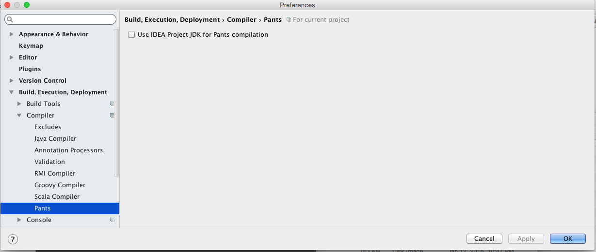

# intellij-pants-plugin

* The intellij-pants-plugin supports importing, compiling and testing [pants](http://pantsbuild.github.io/) projects.
* The plugin only supports Scala and Java projects.
* As of 12/10/2015, latest version of the plugin only works with IntelliJ IDEA 15.0.0 and >=15.0.2. Do not use 15.0.1.

## User documentation

### Installing the Plugin
Please use “Plugins” tab: (Main menu: Settings | Plugins) to install the plugin.
Find "Pants Support" plugin. Install and Restart IntelliJ.

#### Importing an entire project directory
  * Use Main menu: File -> Import Project(in IJ 14.1+: File -> New -> Project From Existing Sources)
  * Select project directory
     
  * Choose "Pants" on the next screen
  * Make sure the check box "All Targets in the directory" is enabled and proceed with the wizard

#### Importing targets from a BUILD File
  * Use Main menu: File -> Import Project(in IJ 14.1+: File -> New -> Project From Existing Sources)
  * Select a Build File from within the project
     
  * Check the targets you want to Import and proceed with the wizard. (Please wait for the targets to show up)
     

#### Importing targets from a script
  * Use Main menu: File -> Import Project(in IJ 14.1+: File -> New -> Project From Existing Sources)
  * Select an executable that will use export goal to produce a desirable project structure. 
    See [an integration test](testData/testprojects/intellij-integration/export1.sh) as an example.

#### Importing several BUILD files/directories(works in IntelliJ 14.1+)
  * Import the first directory/BUILD file
  * Use File -> New -> Module From Existing Sources to import next directories/BUILD files

Once you import the project using above steps, you will see the "Project View" with multiple modules configured.

### Invoking Pants within IntelliJ
The plugin can invoke any Pants commands via Pants Tasks. 
  * To configure a Pants Task simply create a new Pants Run Configuration
    
  * Choose a target to run a task for
    
    
  * Fill the rest of options for the task. Note there is a task for each Pants goal.
    
  * Run the Task
    
  * To debug a task simply press Debug button next to Run button.
  * Note: you can create a task for any goal
    
    
#### Predefined Pants Tasks for test targets
The plugin can preconfigure test Tasks from a context. 

For example if a test class is opened then with a right click it's easy to create a task to run and debug
     
    
    
With a right click in Project View it's easy to create a test task to run all tests for a target
     

### Compilation
The plugin provides two ways to compile your project:
* via pants' compile goal (Default)
  The plugin will use `pants compile <list of targets>` to compile your project once a `Make` command is invoked.
  
* via IntelliJ's scala/java compilers
  Because the plugin configured all modules' dependencies IntelliJ can use this information to build and run your project without
  invoking pants. Using just internal representation of the project's model. We recommend to use first option to be consistent with
  command line invocation.

Compilation options can be configured in Preferences -> Build, Execution, Deployment -> Compiler -> Pants:


### Plugin Features.
* Project File Tree View.
  The plugin configures modules per pants build target. Due to multiple modules, the default "Project View" is not very user friendly.
  The Plugin provides a custom view "Project Files Tree View". This view adheres to your repository file hierarchy.
  You can switch to this view as follows:
  
  "Project Files Tree View" also provides an ability to filter out files that weren't loaded during project generation.
  
* BUILD File code assistance
  The plugin provides auto completion for target names in a BUILD file such as `jar_library`, `scala_library`, etc.
  As well as completion for dependencies' addresses.
* Project Regeneration using IntelliJ Action.
  If you add a dependency to your project, you can re-resolve project using IntelliJ Action in background.
  Use Main Menu: Help -> Find Action or Short hand Cmd+Shift+A and select Action "Refresh all External Projects"
  Remember to check "Include non-menu actions"
  
* Compiling within IntelliJ
* Running tests within IntelliJ
  You can right click on tests and run tests.
* Open dependents of targets
  To perform a refactoring of a common target you need to change all targets that depend on the given target. 
  To load such dependents using the plugin simply open Preferences -> Build Tools -> Pants and check Load Dependents Transitively.
  

### Report Bugs
If you see any bugs please file a github issue on the project page.
Attach your `idea.log` ([location instructions](https://intellij-support.jetbrains.com/entries/23352446-Locating-IDE-log-files))

For contributing to the project, continue reading below.

### How the plugin works

The plugin uses `pants resolve export <list of imported targets>` command to get an information
about an imported project. `pants resolve export <list of imported targets>` command returns information
about all targets that are needed to be imported for the project in JSON format. It contains information about all dependencies of a target
as well as the same information for each dependency. Then the plugin creates an IntelliJ module for each target, configures
dependencies(modules and libraries) and source roots.

Let's check an output of `./pants export examples/src/java/org/pantsbuild/example/hello/main:main-bin` command:

```json
{
    "libraries": {},
    "targets": {
        "examples/src/java/org/pantsbuild/example/hello/greet:greet": {
            "is_code_gen": false,
            "target_type": "SOURCE",
            "libraries": [],
            "pants_target_type": "java_library",
            "targets": [],
            "roots": [
                {
                    "source_root": "/Users/fkorotkov/workspace/pants/examples/src/java/org/pantsbuild/example/hello/greet",
                    "package_prefix": "org.pantsbuild.example.hello.greet"
                }
            ]
        },
        "examples/src/java/org/pantsbuild/example/hello/main:main-bin": {
            "is_code_gen": false,
            "target_type": "SOURCE",
            "libraries": [],
            "pants_target_type": "jvm_binary",
            "targets": [
                "examples/src/java/org/pantsbuild/example/hello/greet:greet",
                "examples/src/resources/org/pantsbuild/example/hello:hello"
            ],
            "roots": [
                {
                    "source_root": "/Users/fkorotkov/workspace/pants/examples/src/java/org/pantsbuild/example/hello/main",
                    "package_prefix": "org.pantsbuild.example.hello.main"
                }
            ]
        },
        "examples/src/resources/org/pantsbuild/example/hello:hello": {
            "is_code_gen": false,
            "target_type": "RESOURCE",
            "libraries": [],
            "pants_target_type": "resources",
            "targets": [],
            "roots": [
                {
                    "source_root": "/Users/fkorotkov/workspace/pants/examples/src/resources/org/pantsbuild/example/hello",
                    "package_prefix": "org.pantsbuild.example.hello"
                }
            ]
        }
    }
}
```

The plugin will create three modules. One for the imported target, examples/src/java/com/pants/examples/hello/main:main-bin
and two for the targets it depends on. It also will configure source roots for the modules and will use `target_type`
and `is_code_gen` fields to figure out types of source roots(there are several types of source roots: sources,
test sources, resources, test resources, generated sources, etc).

## Contributing Guidelines:

* Checkout the code

        git clone https://github.com/pantsbuild/intellij-pants-plugin

* Create a new branch off master to make your changes

        git checkout -b $FEATURE_BRANCH

* Push your branch and pass travis ci


* Post your first review ([setup instructions](http://pantsbuild.github.io/howto_contribute.html#code-review))

        ./rbt post -o -g

* Iterating over the review

        ./rbt post -o -r <RB_ID>

* Committing your change to master

        git checkout master
        git pull
        ./rbt patch -c <RB_ID>

### IntelliJ project setup:

* Download and open IntelliJ IDEA 15 Community Edition
* Install Python, Scala, and Gradle Plugins
* Open the project via File -> Open, then select the plugin source folder. Do not import the plugin source as pants project because the plugin does not work on itself.
* Use IntelliJ IDEA 15 Community Edition as IDEA IC SDK. Project Structure(Cmd + ;) -> SDK -> '+' button -> IntelliJ Platform Plugin SDK
* Setup the SDK's classpath
  * Add the following to the SDK's classpath
    * `~/Library/Application Support/IdeaIC15/python/lib/python.jar`
    * `~/Library/Application Support/IdeaIC15/Scala/lib/scala-plugin.jar`
    * `~/Library/Application Support/IdeaIC15/Scala/lib/jps/*.jar`
    * `/Applications/IntelliJ IDEA 15 CE.app/Contents/plugins/gradle/lib/gradle.jar`
    * `/Applications/IntelliJ IDEA 15 CE.app/Contents/plugins/junit/lib/idea-junit.jar`
* Set Scala 2.11.2 as your Scala SDK
* Make sure that your project is set to configure bytecode compatible with 1.6.  Preferences -> Compiler -> Java Compiler -> Project bytecode version
* Run tests to verify your installation

### Release process:

* Bump version number in plugin.xml, push the change, make sure travis ci is green
* To build from sources a pants.zip distributive simply invoke Build -> Build Artifacts... -> pants -> Rebuild
* Zip out/artifacts/pants folder into pants.zip
* Validate the plugin manually in IntelliJ: Preferences -> Plugins -> Install from disk -> pick newly created pants.zip
* Upload pants.zip to https://plugins.jetbrains.com/plugin/7412

### Debugging the Plugin from local pants development:

* To debug tests execute:

        ./scripts/run-tests-ci.sh --test-junit-debug
        
  It will listen for a debugger on 5005 port by default. 
  
  Create a Remote Run Configuration in IntelliJ. By default it uses 5005 port as well.
  
  Hit debug button to connect to Pants.

* If you want to debug plugin using your local development pants, you can do so by using the property `pants.executable.path`.
  Add this configuration to Pants Run config.
  e.g.

        -Dpants.executable.path=/path/to/pants_dev/pants

* To debug JPS compiler use:

        -Dcompiler.process.debug.port=PORT        

* Remember to bootstrap pants in the project repository inside which you want to test the plugin.

        cd ~/workspace/example_project
        /path/to/pants_dev/pants goals

  This will bootstrap pants and resolve all the dependencies or else you will get an `ExecutionException` exception for exceeding 30s timeout.

# Running plugin tests with Pants

* Use `./scripts/setup-ci-environment.sh` with targeted `IJ_VERSION` and `IJ_BUILD_NUMBER` 
  environment variables from `.travis.yml` file to load everything for running tests. For example:
  
        IJ_VERSION="15.0" IJ_BUILD_NUMBER="143.381" ./scripts/setup-ci-environment.sh
        
* Execute `./scripts/run-tests-ci.sh` from command-line.
* Running individual test. For example:

        ./scripts/run-tests-ci.sh --test-junit-test=com.twitter.intellij.pants.integration.OSSPantsJavaExamplesIntegrationTest#testJaxb

